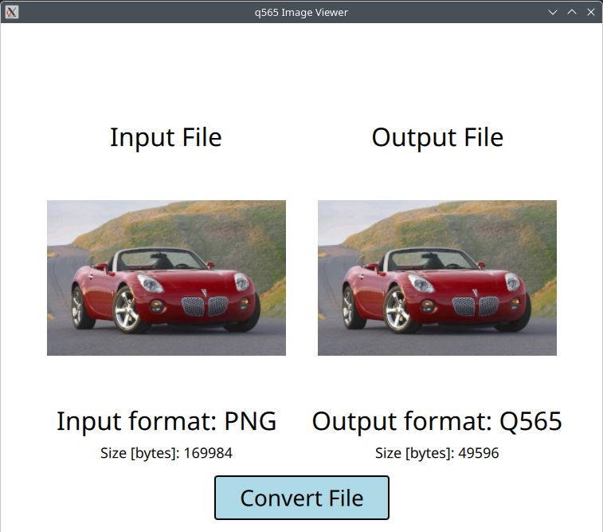

# q565viewer
A visual conversion tool that will help test q565 implementations.
This tool demonstrates creating a Qt5 image format plugin as well as unit testing it.

This tool can load in a file of (most) image file formats and convert it to a q565 (RGB16) image.
Often there will be few discernable differences between images but there are significantly fewer colors in RGB16.

The gain comes in the size of bytes the image needs to be communicated. 

Q565 includes multiple compression methods and this code currently implementations

## Supported Compression Features:

- [x] Color Difference (describe a pixel as a difference from the prior pixel)
- [x] Color run, uses a single byte to describe up to 62 contiguous pixels of one color
- [x] Color Table (index a unique color value) to be referenced by ID (0..63)
- [x] Lumocity difference
- [x] Color table difference
- [x] Unit test benchmarking encoding and decoding q565 image format
- [x] Unit Test for correctness of q565 implementation and correct image (decoding)
- [ ] Exact byte for byte output matching q565-rust library
- [ ] Direct integration of q565-rust code for better unit testing

This project can optionally utilize the [AIOLCDUnchained](https://github.com/brokenmass/AIOLCDUnchained) Python decoder to test images.
The Q565 image format plugin is largely inspired and directed by [Q565 Rust Library](https://docs.rs/q565/latest/q565/) 

